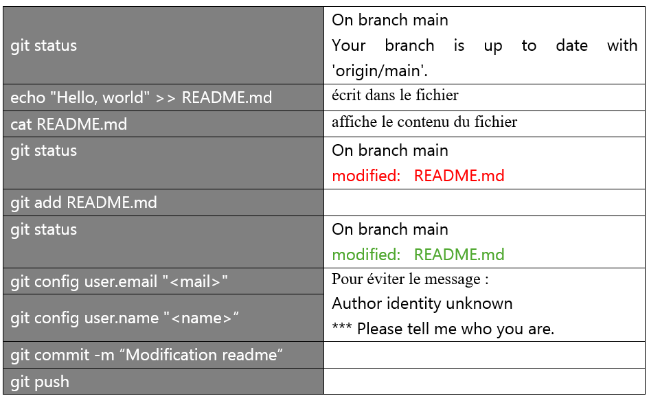
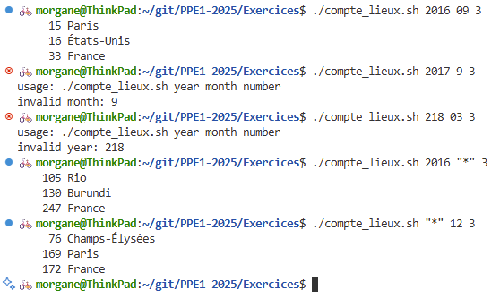
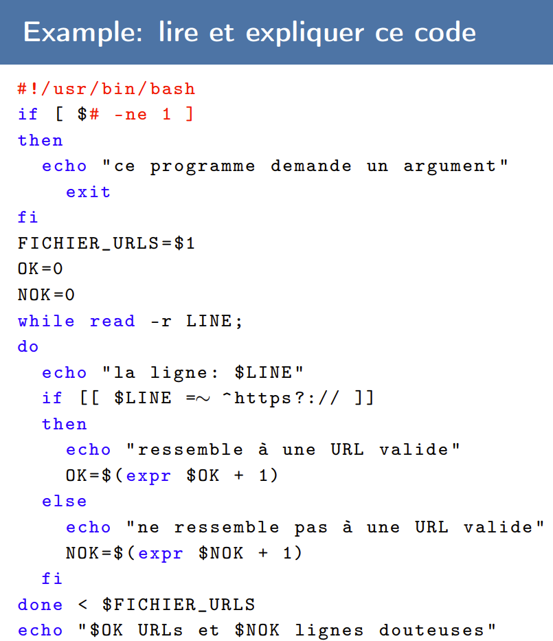

# Journal de bord du projet encadré

# Semaine 1 – 24 septembre  
## Notions abordées en cours  
fichier, dossier/répertoire, dossier « parent », arborescence, racine, dossier personnel, dossier courant, chemin absolu ou relatif, caractères de remplacements (wildcards)  

## Travail à la maison  
J’ai réalisé l’exercice 1 à la maison, sur mon ordinateur fixe. J’ai copié les lignes de commandes utilisées :  

```bash
mkdir Exercice1  
cd Exercice1  
wget "http://plurital.org/ppe1/seance1/archive-25.zip"  
unzip archive-25.zip  
mkdir -p {txt,ann}/{2016,2017,2018}/{01,02,03,04,05,06,07,08,09,10,11,12}  
mkdir -p img/{Paris,Tokyo,Washington}  
mkdir docs  
mv 2016_01_*.txt txt/2016/01
```

J’ai découvert l’option -p + accolades avec la commande mkdir pour créer deux dossiers (parents) partageant la même structure interne (ici, les sous-dossiers « année » et les sous-sous-dossiers « mois »). Très pratique !  

## Réflexions personnelles  
-	Je connaissais la plupart des commandes présentées lors du cours. J’ai profité de l’occasion pour « feuilleter » les manuels (man) de ces fonctions et découvrir de nouvelles options.  
-	J’ai beaucoup utilisé les commandes git auparavant pour :  
    - envoyer sur github les améliorations apportées à mon projet personnel « Magister Conjugationis » (pour réviser mes conjugaisons en latin)
    - synchroniser le contenu de mes ordinateurs fixe et portable  
-	Je me suis donc créé deux tableaux (voir ci-dessous) pour me rappeler :  
    - les principales commandes git  
    - les dossiers les plus importants à la racine  
-	J’ai beaucoup aimé jouer avec les lignes de commandes du terminal et j’ai retrouvé l’envie passer la certification « Linux Essentials » du Linux Professional Institute (LPI) que j’avais commencé à préparer cet été mais que j’avais laissée de côté au profit de Python (il ne reste plus à présent qu'à trouver un centre où passer l'examen, et ce n'est pas une mince affaire).  


# Semaine 2 – 1er octobre  
## Notions abordées en cours  
git vs github, ensemble des commandes git (en particulier commit), clé ssh  
Routine : git pull > modifications > git add / git rm > git commit > git push > git tag  


## Travail à la maison  
Du git !
Nous avons créé notre premier tag en suivant la syntaxe suivante : git tag [-a][-m message] <tagname> [commit], sans oublier que les tags exigent un git à part pour eux seuls : git push --tags
-   par exemple pour notre exercice : git tag -a -m "Exercice 1 - Premier script" tp1-ex1


## Réflexions personnelles  
-	J'avais créé ma clé SSH il y a quelque temps déjà pour les besoins de mes divers projets sur GitHub  
-	De même, j'étais déjà à l'aise avec les commandes git, indispensables pour communiquer entre mon profil GitHub et mes ordinateurs fixe et portable
-   J'ai mis à jour ma liste de commandes git dans le fichier où je rassemble toutes les commandes et routines utiles sous Linux


-	Vivement la suite !   


# Semaine 3 – 8 octobre  
## Notions abordées en cours  
Nous avons appris à rediriger certaines commandes à l'aide de chevrons et de pipelines :
- l'entrée standard (0 stdin), la sortie standard (1 stdout), la sortie d'erreurs standard (2 stderr)
- chevrons simples (>, >$, 2>) pour écraser le fichier
- chevrons doubles (>>, >>$, 2>>) pour écrire à la fin du fichier existant, sans l'écraser  
Ex : cat *.txt | grep université | wc > output.txt


## Travail à la maison  
Du bash !  
Pour réaliser les exercices, il m'a fallu lire les manuels des commandes suivantes : grep, sort, uniq, echo, cut et tail (+ head qui ne figurait pas sur la liste fournie)

```bash
#!/usr/bin/bash

year=$1
month=$2
number=$3

if ! [[ "$year" =~ ^[0-9]{4}|\*$ ]]
then
    echo "usage: $0 year month number"
    echo "invalid year: $year"
    exit 1
fi

if ! [[ "$month" =~ ^([0-9]{2}|\*)$ ]]
then
    echo "usage: $0 year month number"
    echo "invalid month: $month"
    exit 1
fi

if ! [ $number -gt 0 ]
then
    echo "usage: $0 year month number"
    echo "invalid number: $number"
    exit 1
fi

cat ../Exercice1/ann/$year/${year}_${month}*.ann | grep Location | cut -f 3 | sort | uniq -c | sort -n | tail -n $number

```



Page de code à expliquer :  


| code bash | explication |
| - | - |
| #!/ usr/ bin/ bash | Le shebang indique qu’il faut exécuter le programme avec bash |
| if [ $# -ne 1 ] | condition à remplir : "si le nombre d’arguments ($#) est différent de (-ne) 1 -> si l'utilisateurice a fourni moins ou plus d'un argument  … |
| then | … alors… |
| echo "…" | Afficher sur le terminal le message entre guillemets |
| exit | Mettre fin au programme |
| fi | Fin de la condition-conséquence |
| FICHIER_URLS=$1 | Assigner l’argument fourni à la variable « FICHIER_URL » |
| OK=0 | Assigner la valeur 0 à la variable « OK » |
| NOK=0 | Assigner la valeur 0 à la variable « NOK » |
| while read -r LINE; | A l’instar de la commande « input » en Python, la commande « read » lit l’input en ignorant les \ (option -r) et l’assigne à la variable « LINE » |
| echo "la ligne : $LINE" | b |
| if [[ $LINE =∼ ^ https ?:// ]] | b |
| then | … alors… |
| echo "…" | Afficher sur le terminal le message entre guillemets |
| OK=$ ( expr $OK + 1) | Ajouter 1 à la valeur de la variable « OK » en utilisant la commande « expr » (équivalent du « += 1 » en Python). On comprend que la variable « OK » comptabilise le nombre d’URL valides. |
| else | Au cas où la condition donnée en « if » ne serait pas réalisée |
| echo "…" | Afficher sur le terminal le message entre guillemets |
| NOK=$ ( expr $NOK + 1) | Ajouter 1 à la valeur de la variable « NOK » en utilisant la commande « expr » (équivalent du « += 1 » en Python). On comprend que la variable « NOK » comptabilise le nombre d’URL invalides. |
| fi | Fin de condition |
| done < $FICHIER_URLS | Fournir à la boucle « while » le contenu de la variable « FICHIER_URLS » |
| echo " $OK URLs et $NOK lignes douteuses " | Afficher sur le terminal le nombre d’URL valides (« $OK URLS ») suivi du nombre d’URL invalides (« $NOK lignes douteuses ») |


## Réflexions personnelles  
- J'ai eu (beaucoup) de mal à dompter la syntaxe propre à bash et à me défaire de mes habitudes pytonesques :  
  - absence d'espace autour du signe "="  
  - place du "!" juste après le "if"  
- Je comprends l'importance d'aller consulter les manuels des commandes mentionnées rapidement en cours pour comprendre leur fonctionnement et réussir à faire les exercices


# Semaine 5 – 22 octobre  
## Travail à la maison  
*Pourquoi ne pas utiliser CAT ?*  
Lorsque l'on utilise CAT dans une boucle for, tous les caractères d'espace comptent comme séparateurs de mots (ce qui affiche donc un mot par ligne). Or, il se trouve que la liste des URL fournie comporte "par erreur" une espace dans une adresse. Avec CAT, cette adresse risquerait de se retrouver sur deux lignes différentes.  

  
# Semaine 6 – 5 novembre  
## Notions abordées en cours  
```bash
Triumvira des caractères spéciaux (en bash ou C) :  
    \t : tabulation  
    \n : retour à la ligne  
    \r : retour charriot  
```
```bash
Caractère d échappement :  
mkdir a\*isborn OU mkdir "a*isborn"  
mkdir un\ dossier OU mkdir "un dossier"  
```

## Travail à la maison  
1. "**miniprojet-1-revu**" : J'ai revu mon script en m'inspirant de la démonstration faite par les enseignants en cours :  
- J'ai continué à étoffer mes commentaires, pour que je sois en mesure de comprendre mon code lorsque je le relirai dans quelques semaines.  
- J'ai lu le manuel de la fonction "cut" pour comprendre le fonctionnement des options "-f" et "-d" afin de n'afficher que les informations pertinentes (en l'occurrence, le charset)   
2. "**miniprojet-2**" : Je me suis attelée au mini-projet-2  (sortie dans un tableau HTML). J'ai eu besoin de créer un fichier .html "brouillon" dans lequel écrire, en HTML, le tableau de sortie que je souhaitais obtenir avec mon script, de façon à savoir clairement quoi demander au script, et comment le demander. J'ai divisé mon code HTML en trois parties, chacune étant associé à sa commande cat << EOF (permettant d'écrire plusieurs lignes en une seule fois) :  
- la première partie, comprenant les premières balises ainsi que la ligne d'en-tête des colonnes, a été collée *juste avant* la boucle while du script et associée à une commande ;  
- la deuxième partie, comprenant une ligne de tableau type destinée à être écrite autant de fois que le nombre de lignes dans le ficher fr.txt, a été collée au sein et à la fin de la boucle while ;  
- la troisième partie, comprenant les dernières balises HTML, a été collée juste après la boucle while...  
... le tout de façon à ce que ces trois parties soient collées les unes aux autres dans la sortie fournie par le script.  
Bien que cela ne paraisse pas dans les consignes, j'ai distingué avec deux noms différents les deux scripts pour ne pas supprimer celui correspondant au premier miniprojet : "miniprojet-1.sh" a une sortie en .tsv, tandis que "miniprojet-2.sh" a une sortie en .html.  

```bash
<html>
	<head>
        <meta charset="UTF-8"/>
        <title>Mini-projet 2</title>
    </head>
    <body>
        <table>
            <tr>
                <th>lineno</th>
                <th>adresse html</th>
                <th>response code</th>
                <th>charset</th>
                <th>word number</th>
            </tr>
            <tr>
                <td>1</td>
                <td><a href="https://fr.wikipedia.org/wiki/Robot">https://fr.wikipedia.org/wiki/Robot</td>
                <td>200</td>
                <td>UTF-8</td>
                <td>0</td>
            </tr>
        </table>
    </body>
</html>
```

## Réflexions personnelles 
Bien que je n'aie pas encore de groupe pour le projet de fin de semestre, j'ai réfléchi à un mot sur lequel je pourrais travailler et qui ne présente pas d'équivalence 1 à 1 évidente en langue étrangère. J'ai pensé au terme "**laïcité**", qui recouvre un concepte très spécifique en droit français et qui peut se traduire de diverses façons en anglais et catalan. J'hésite sur entre ces deux langues mais je penche sur la seconde, qui me permettrait d'explorer une langue moins dotée, dans la lignée de l'article "Pre-training Data Quality for Low-Resource Languages: New Corpus and BERT Models for Maltese" (Micallef et al., 2022) que je vais présenter en cours d'"Analyse linguistique de modèles de langues".  
Je pense que je devrai lister *en amont* la liste des traductions possibles pour le terme choisi, quel qu'il soit, et ce afin de pouvoir ratisser le web avec efficacité. Ce projet adopterait donc une approche *corpus-based*, dans la mesure où le terme étudié et ses traductions possibles sont définis en amont. Cependant, une phase exploratoire plus inductive (*corpus-driven*) pourra ensuite permettre de repérer des variantes émergentes ou non prévues initialement.  


# Semaine 7 – 12 novembre  
## Notions abordées en cours  
- Comment faire un site vitrine à partir de GitHub  
- Présentation de la bibliothèque Bulma CSS  
- Expressions régulières (regex)  

## Travail à la maison  
- Consulter la documentation Bulma en ligne
- Modifier une copie du tableau (.html) produit par le script (.sh) des semaines précédentes en y intégrant des modifications de style avec Bulma.  
- Une fois que le résutat est satisfaisant, modifier directement le script de façon à ce qu'il produise un résultats similaire au tableau .html modifié.  
- Créer et publier sur GitHub deux pages HTML :
  - une page d'accueil index.html qui utilise le style Bulma avec :  
    - une présentation rapide du mini-projet ;  
    - le lien vers...  
  - ... la page HTML qui contient le tableau de résultat


## Réflexions personnelles 
La librairie Bulma est assez bluffante (le ratio temps de prise en main / résultat obtenu est très satisfaisant). J'en ai parlé autour de moi à des informaticiens qui y ont jeté un oeil et ont eux aussi été conquis. Cela m'a rappelé Bootstrap, que j'avais utilisé pour développer ma page personnelle il y a une douzaine d'années...   
Ayant moi-même un projet personnel de page internet (pour recenser tous les cols épinglés à vélo, listés aujourd'hui dans un Excel), certes constamment relégué derrière les devoirs du master pluriTAL, je conserve soigneusement dans mes favoris la documentation Bulma pour y revenir à ma guise (et ne serait-ce pour le projet de groupe du premier semestre).  
  
Concernant mes choix de style pour le miniprojet-3 :  
- j'ai préféré rester sobre pour le tableau, en restant sur des nuances de gris et sans me perdre en fioritures ("keep it simple!")  
  - toutefois, j'ai ajouté à mon script une boucle if/else pour faire apparaître en rouge les code de réponse HTTP qui ne correspondent pas à 200 (deux cas dans les exemples du miniprojet), et ce afin de contrebalancer ma décision de ne pas corriger ces réponses "erronées" pour laisser l'utilisateurice en prendre connaissance.  
- j'ai un peu plus joué avec la palette de couleurs et les options offertes par Bulma pour la page princpale (index.html).  

En conclusion : une expérience chronophage mais passionnante ! Je sais que je serai amenée à utiliser à nouveau la librairie Bulma, dans ma vie professionnelle comme personnelle.  


# Semaine 8 – 19 novembre  
## Notions abordées en cours  
```bash
cat exemple.txt | grp moulins | sed 's/moulins/MOULINS/'  
cat exemple.txt | grp moulins \(...\) | sed 's/moulins/MOULINS/' # à bricoler pour les exercices à faire à la maison.  
```
```bash
# Gestion de conflits de versions
git fetch # récupérer les métadonnées du dépôt (voir si on a des commits de retard)
git reset # annuler les add mais pas les commits (ne supprime par défaut aucun changement)  
    git reset HEAD~ # revenir à la dernière version du dépôt et annuler les add
	git reset <commit> # ex : un identifiant SHA ou un tag
git revert
git stash 
git checkout # se "téléporter" directement à un état donné.
	git checkout <commit>
	git checkout <fichier>
	git checkout <commit> - [fichier ...]
```
**Expressions régulières / Regex (suite)**
- Lookahead X(?=Y) ou X(?!Y) et Lookbehind (?<=Y)X ou (?<=Y)X ou encore (*pla: ... ) (*plb: ... ) (*nla: ...) (*nlb: ... )

## Travail à la maison  
```bash
"((https?:\/\/(www)?)|(www\.))(([a-zA-Z]|-|_)+\.)*([a-z]){2,}\/?([a-zA-Z]|[0-9]|-|_|(\/|\?|\=))*" # URL
"/((\+[0-9]{2,3})( |\.|\-)?(\(0\)[0-9]( |\.|\-)?))?(([0-9]{2,3})( |\.|\-)?){4,5}/gm" # numéro de téléphone
"/(\w|(à|é|è|ï|ü|ë|ê|â|û|ô|ÿ|ç))+(?=( |,|\.|\)|:|!|\?))/gm" # isoler chaque mot
```

- Repérage des "moulins à vent" sur le texte de Don Quichotte (.txt)  
- Pseudo-lémmatisation de MANGER ("mangeaient" &rarr; "MANGER+eaient")  
- &rarr; Le tout en utilisant "grep" et "sed"  

```bash
# cat : affiche le contenu du fichier dans le terminal
# grep : filtre les lignes contenant le mot ou regex (avec -E)
# sed : s/// remplace l'expression recherchée (entre les deux premiers /) par une autre (entre les deux derniers /). Les numéros renvoient aux groupes de capture de la regex (entre les deux premiers /). Attention aux échappements de caractères spéciaux (y compris les parenthèses, les pipes et les +)

cat pg16066.txt | grep moulins | sed 's/moulins à vent/moulins-à-vent/'
cat pg16066.txt | grep -E "mang(e|i)" > moulins.txt
cat pg16066.txt | grep -E "mang(e|i)" | sed 's/\(^\| \|")mang\([^\.,; ]\+\)/\1MANGER+\2/g' > manger.txt # incomplet (laisse passer trop de cas de figure : mangue + ponctuation, tabulations...)
cat pg16066.txt | grep -E "mang(e|i)" | sed 's/\(^\|[[:punct:][:space:]]\)mang\(i\|e\)\([^[:punct:][:space:]]*\)/\1MANGER+\2\3/g' > manger.txt

# groupe 1 = \(^\|[[:punct:][:space:]]\) --> uniquement les mots précédés d'une espace (au sens large), d'un signe de ponctuation ou début de ligne (^)...
# groupe 2 = \(i\|e\) --> pour éviter "mangue" ou "mangrove",...
# groupe 3 = \([^[:punct:][:space:]]*\) --> qui soient suivis de tout caractère qui ne soit pas (^ = "différent de") une espace ou un signe de ponctuation
# [:punct:] --> caractères spéciaux (:;.?!-'"())
# [:space:] --> espace, espace inseccable, tabulation, etc.
# \1 \2 \3 --> correspond au groupe de capture de la regex
# g = global --> pour remplacer plusieurs occurences (différentes ou non) de la regex par ligne

echo "Il lui dit : 'mange ta mangue dans la mangrove'" | grep -E "mang(e|i)" | sed 's/\(^\|[[:punct:][:space:]]\)mang\(i\|e\)\([^[:punct:][:space:]]*\)/\1MANGER+\2\3/g'
```

## Réflexions personnelles 
Bash + sed = combo infernal !